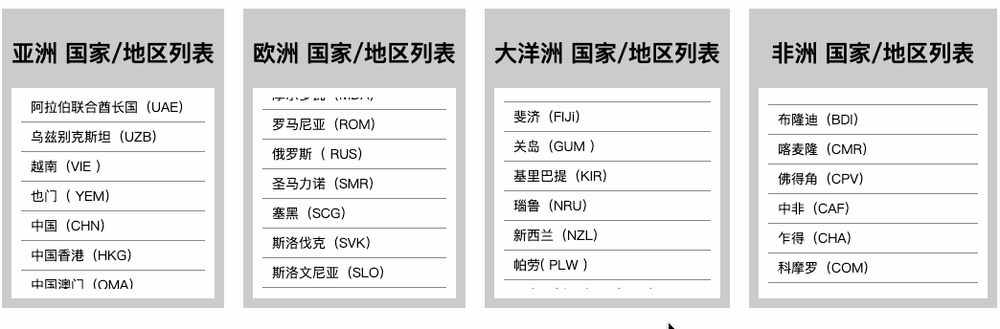

# vue-scrolling-ul


[![blog](https://img.shields.io/badge/blog-yesifang.com-orange?logo=data:image/png;base64,iVBORw0KGgoAAAANSUhEUgAAACAAAAAgCAMAAABEpIrGAAAABGdBTUEAALGPC/xhBQAAACBjSFJNAAB6JgAAgIQAAPoAAACA6AAAdTAAAOpgAAA6mAAAF3CculE8AAABjFBMVEUAAAAIAQUiBhQVBA05CyK0I2z4MJTgKoV8GEoKAgZyFkT8MZfTKX4dBRFWEDP9MZfMJ3kGAQQHAQTlK4htFUEAHRMATDAAbUQAf1EAh1QAgFAAbUUATDAAHhNMDy7KJngAeUsAKBp9GEr4MJMDAQIAmWEAWzkABAOGGlD9MZYAcUgABQNoFD7mLIoAZUCdHl4ANiKiH2EpCBgAh1UAAgERAwrVKH9nFD0ALBwSAwuqIWXmK4pTEDIAWTgrCBp2F0eVHVmKG1NWETMAdEgAgVAAAQIAJTcATXIAZJQAbqUAap0AVoEAfE4AAQEAN1EAgMAAaEIACQ4Aap4ARiwACQ0AebMAmV8AEwwAAAAAZ5oAZT8AMkkAkFoAEQsAebMAl14AGCQAkl0ALx4AOlYAeEsAGRAATHAAbkUAll0All4AbkYAMB4ATXMABwQAIxYANiIAPicANyIAJBYAQF4AIjIAis0AAgMAhsYAZJYARWYAk9oAHy4ABQcAfbkAO1gAis3/MZgAmmEAld3///8EabibAAAAgHRSTlMACCIVObX54XwKcv3UHVb+zQYH5m0xfrTU4NW1fzJMy8hDffkD/pcHh/69CGjnqJ5ZoynfBBHWZ0kSqudTlCt2lotWwNUCQIOrvrWVzwFe3a4QtnQPz/0gAbKnVe4c0Psp9E9jximBtvj4t0+FCzpaZlo7bTruA+Wtdfs1CNdm7ZpKyEIAAAABYktHRIP8tM/SAAAAB3RJTUUH5QoVBh0NInrzjgAAATtJREFUOMt902VbwzAUBeDLcAYMhru7uzPcXYcP1+EyPMkvZ03TNk0TztfzNnL7BECeCFck/JOo6BiEYuPiVX2CG9EkJsn7ZA9iSUmV9d40ZCYdICMzKzsnNy+/wASFVo+KALCR4hIGSjlQVm4BXFFZRUE1B2q8HMC4tk4D9RxoABvAjRpwuS3QJADcrIkW6witImhrD4OOTtZ7ukAEuFtboqeXjqqvH5xgQL/qoG9oeET/FQIYdQxWAGNmMT4xOTU9MyuCOVbPLywSGhEs6f3yCiFysEr7tXWiABubWu/fIiqwTRfYISqwu0fBvgoc0DlCgCjA4ZF+hWMFODllMzizgfML2l5eXfuNGd7YAARv7+4fHoPc9J/swJlnrn+Rgdc3C4SkT+vd7D8+peDr2+h/FK838Ev3D4W//wNiKCWwWalJAwAAACV0RVh0ZGF0ZTpjcmVhdGUAMjAyMS0xMC0yMVQwNjoyOToxMyswMDowMP1Zb/cAAAAldEVYdGRhdGU6bW9kaWZ5ADIwMjEtMTAtMjFUMDY6Mjk6MTMrMDA6MDCMBNdLAAAAAElFTkSuQmCC)](//yesifang.com)

> 这是一个 Vue2 组件，提供一个自动滚动的 ul 列表。
>
> This is a Vue2 component that provides a list of ul that scrolls automatically.

[English Document](../README.md.md)

<div align="center">
  <a href="https://nodei.co/npm/vue-scrolling-ul/"></a>
</div>

## 运行简单示例



```shell
$ git clone https://github.com/SuperYesifang/vue-scrolling-ul.git
$ cd vue-scrolling-ul
$ npm install
$ npm run dev
```

## 使用

### 1. 全局使用

-   main.js

```js
import Vue from "vue";
import VueScrollingUl from "vue-scrolling-ul";

Vue.use(VueScrollingUl);

new Vue({
  el: "#app",
  render: h => h(App)
});
```

-   App.vue

```vue
<template>
  <div id="app">
    <vue-scrolling-ul>一些LI标签 ...</vue-scrolling-ul>
  </div>
</template>
略...
```

### 2. 直接使用

-   App.vue

```vue
<template>
  <div id="app">
    <scrolling-ul>一些LI标签 ...</scrolling-ul>
  </div>
</template>

<script>
  import ScrollingUl from "vue-scorlling-ul";

  export default {
    name: "App",
    components: {
      ScrollingUl
    }
    略...
  };
</script>
```

## 选项

vue-scrolling-ul组件接受以下 Vue prop 配置项。

| prop     | 含义                                                                                                | 类型         | 默认值         |
| -------- | ---------------------------------------------------------------------------------------------------------- | ------------ | --------------- |
| start    | 启用滚动。                                                                                    | Boolean      | `true`          |
| smmoth   | 启用平滑滚动。                                                                                  | Boolean      | `true`          |
| infinity | 启用无限滚动。                                                                                | Boolean      | `true`          |
| bar      | 虚拟滚动条的配置。                                                                              | `barOptions` | `{show:'auto'}` |
| speed    | 滚动的速度。(单位: `像素/秒`, 备注: 必须是一个正数)                                     | Number       | `30`            |
| delay    | 滚动的间隙时间。 (单位: `毫秒`, 备注: 只有 `smooth` prop 为 `false` 时有效，必须是一个正数) | Number       | `3000`          |
| nice     | 启用自定义css样式以覆盖默认样式。                                            | Boolean      | `false`         |

### bar选项

Type: Object

| 属性 | 含义                             | 类型                | 默认值  |
| -------- | --------------------------------------- | ------------------- | -------- |
| show     | 显示虚拟滚动条。             | Boolean 、`"auto"` | `"auto"` |
| style    | 虚拟滚动条的自定义css样式。 | Object              | 略...  |

## 更多自定义样式

如果您想使用CSS自定义更多样式。您可以使用以下类名。(只有当 `nice` prop 为 `true` 时有效)

| 类名                    | 含义                                        |
| ---------------------------- | -------------------------------------------------- |
| `scrolling-nice-bar`         | 虚拟滚动条的基础类名。                        |
| `scrolling-nice-bar.barShow` | 虚拟滚动条现实时的类名。                         |
| `scrolling-nice-ul`          | 滚动列表的基础类名。                 |
| `scrolling-nice-ul.bar`      | 滚动列表启用虚拟滚动条时的类名。 |
